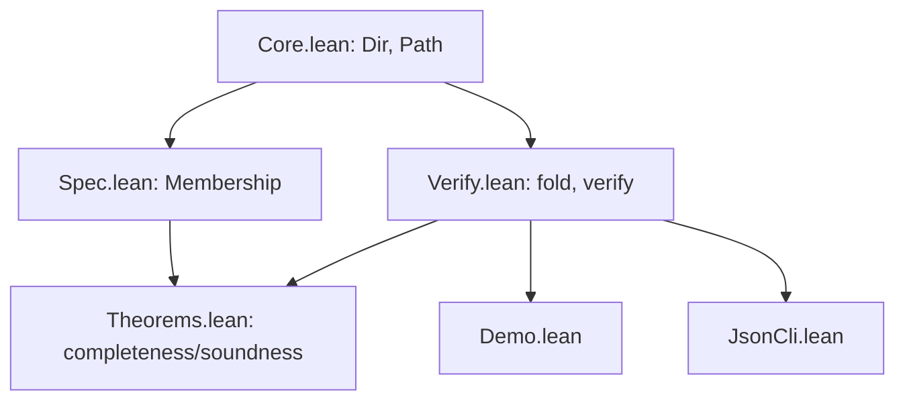
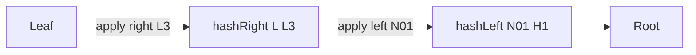

# Lean 4 Merkle Example


A compact, portfolio-ready Lean 4 project: Spec → Executable → Proofs → Demo/CLI.

## Contents

- Build — [Build](#build)
- Files — [Files](#files)
- Run demos — [Run](#run)
- Guided docs — [Guided docs (start here)](#guided-docs-start-here)
- Architecture — [Architecture at a glance](#architecture-at-a-glance)
- Fold visualization — [Fold visualization](#fold-visualization)
- Real-world mapping — [Real-world mapping](#real-world-mapping)


A self-contained Lean 4 + Lake project demonstrating a toy Merkle membership:
- `Spec.lean`: abstract inductive `Membership` relation.
- `Verify.lean`: executable verifier (`fold` + `verify`).
- `Theorems.lean`: statements for completeness and soundness (with `sorry` stubs to fill).
 - `Core.lean`: shared core types (`Dir`, generic `Path`).
 - `Demo.lean`: runnable demo (no `#eval` in source files).
 - `JsonCli.lean`: JSON-driven test harness (CLI).

## Prereqs
- Install elan (Lean toolchain): https://lean-lang.org/lean4/doc/quickstart.html

## Why Lean?
- Declaratively model the spec (`Membership`) and keep it separate from the executable checker.
- State and prove key properties (completeness/soundness) directly in code.
- Small, readable proofs with the option to scale to real cryptographic hashes later.

## Build
```bash
# If lake is on PATH
lake update && lake build

# If not on PATH
~/.elan/bin/lake update && ~/.elan/bin/lake build
```

## Files
- `src/Merkle/Core.lean`
- `src/Merkle/Spec.lean`
- `src/Merkle/Verify.lean`
- `src/Merkle/Theorems.lean`
  - `src/Merkle/Demo.lean`
  - `src/Merkle/JsonCli.lean`
  - `docs/merkle-fold.md` (diagram)

## Guided docs (start here)
 If you're new to Merkle proofs or Lean, read these short guides with flowcharts and examples:
 - [Core (types)](docs/merkle/core.md)
 - [Spec (model)](docs/merkle/spec.md)
 - [Verify (executable)](docs/merkle/verify.md)
 - [Theorems (guarantees)](docs/merkle/theorems.md)
 - [Demo (CLI 1)](docs/merkle/demo.md)
 - [JSON CLI (CLI 2)](docs/merkle/json-cli.md)

## Notes
- `hash` is a placeholder over `Nat` to keep the model small. Swap with a proper byte-level hash later.
- Proofs are intentionally short and commented with `-- Reason:` hints.

## Run
Executable demos (no `#eval` needed):

```bash
# Demo showcasing two examples and a mini 2-level tree
lake build merkle-demo && lake exe merkle-demo

# JSON-driven CLI (reads a list of cases)
lake build merkle-verify-json && lake exe merkle-verify-json docs/sample-vectors.json

# If lake is not on PATH, prefix with ~/.elan/bin/lake
# Or export PATH for this shell and run directly
# export PATH="$HOME/.elan/bin:$PATH"
# ./.lake/build/bin/merkle-demo
```

Expected output (four lines): `true`, `false`, `true`, `false`.

### Verbose output (for learning)
`src/Merkle/Demo.lean` also prints step-by-step fold details so you can see how the accumulator changes at each path step:

```
Verbose Demo fold (demoLeaf, demoPath):
  start leaf = [5]
  step 1: dir=left, sib=[7] -> acc=[1, 7, 5]
  step 2: dir=right, sib=[3] -> acc=[1, 1, 7, 5, 3]

Verbose MiniTree fold (L2, pathL2):
  start leaf = [12]
  step 1: dir=right, sib=[13] -> acc=[1, 12, 13]
  step 2: dir=left, sib=[1, 10, 11] -> acc=[1, 1, 10, 11, 1, 12, 13]
```

## CI
This repo includes a minimal GitHub Actions workflow under `.github/workflows/ci.yml` that installs elan and runs `lake update` and `lake build`.

## Walkthrough (2–3 minutes)
1) Problem → Model (Spec)
   - Open `src/Merkle/Spec.lean` and explain the inductive `Membership` relation (root, leaf, path with left/right steps).
2) Executable Checker (Verify)
    - Open `src/Merkle/Verify.lean` and show `hashLeft`/`hashRight`, `fold`, and `verify`.
    - Run `lake exe merkle-demo` to show `true/false` outcomes.
3) Guarantees (Theorems)
    - Open `src/Merkle/Theorems.lean` and show:
      - `fold_eq_of_membership` (spec ⇒ concrete fold)
      - `completeness` (Membership ⇒ verify true)
      - `membership_fold_self` (fold builds a valid path model)
      - `soundness` (verify true ⇒ Membership)
 4) Visualize the fold
    - Open `docs/merkle-fold.md` (Mermaid diagram for left/right steps, fold to root).
 5) JSON CLI
    - Show `docs/sample-vectors.json` and run `lake exe merkle-verify-json docs/sample-vectors.json`.
 6) Wrap-up
    - Explain how to swap `hash`, add domain separation, or move to byte arrays.

## Architecture at a glance



## Fold visualization

Inline example (GitHub renders Mermaid):



More detail: see `docs/merkle-fold.md`.

## Real-world mapping

Read `docs/real-world-explainer.json` for a step-by-step walkthrough and mappings to:
- Light clients (inclusion proofs vs block header root)
- Allowlists/state (root on chain, verify membership)
- ZK circuits (fold constrained in-circuit; root public)

Assumptions:
- Domain separation for left/right is mandatory.
- Use standard or circuit-friendly hash (SHA/Keccak/Poseidon) in production.
- Root authenticity (consensus/signature) is required.
