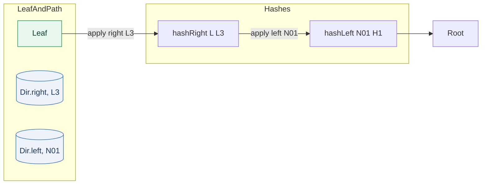

# Merkle Fold Diagram (Toy)

This diagram shows how `fold` recomputes the root from a leaf along a path.

Legend:
- `(Dir.right, s)` applies `hashRight acc s`.
- `(Dir.left, s)` applies `hashLeft s acc`.

In `src/Merkle/Verify.lean`, `fold` implements this process using `foldl` with domain-tagged hashing to avoid ambiguity.
