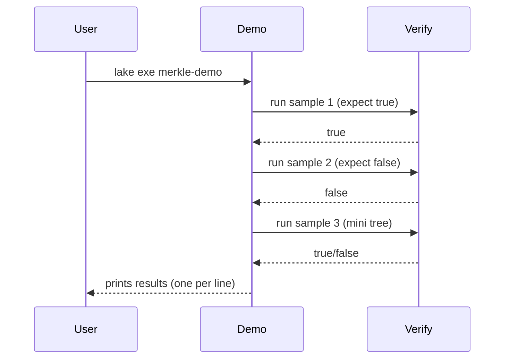

# Demo (merkle-demo)

Purpose: runnable examples showcasing true/false outcomes without `#eval`.

- Entry: `Merkle.Demo` (executable: `merkle-demo`)
- Uses `Verify.verify` with hardcoded sample cases

## Sequence


## How to run
```bash
lake build merkle-demo && lake exe merkle-demo
```

Expected output (example):
```
true
false
true
false
```

## Blockchain mapping
- Mirrors how wallets/light clients might locally verify a few proofs against a known root.
- Useful for demos, docs, tutorials; not meant for production deployment by itself.
