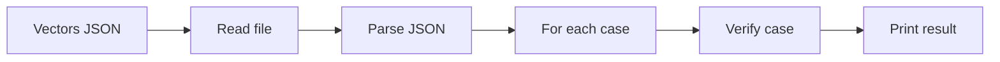

# JSON CLI (merkle-verify-json)

Purpose: verify many proofs from a JSON file and print true/false per case.

- Entry: `Merkle.JsonCli` (executable: `merkle-verify-json`)
- Reads an array of cases: `{ root, value, path: [{dir, sib}, ...] }`

## Flow


## Example JSON
```json
[
  {"root": 123, "value": 7, "path": [{"dir":"R","sib":3},{"dir":"L","sib":1}]},
  {"root": 55,  "value": 9, "path": []}
]
```

## How to run
```bash
lake build merkle-verify-json && lake exe merkle-verify-json docs/sample-vectors.json
```

## Blockchain mapping
- Mirrors how an indexer or light client might batch-verify proofs against a known root.
- Adaptable to contract calls or off-chain validation pipelines.
