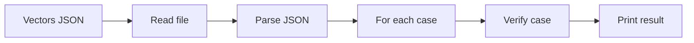

# JSON CLI (merkle-verify-json)

Verify multiple Merkle membership proofs from a JSON file and print a result for each case.

- **Entry point**: `Merkle.JsonCli` (executable: `merkle-verify-json`)
- **Input**: array of cases `{ root, leaf, path: [{ dir, sib }, ...] }`
- **Labels**: byte lists (e.g., `[12]`), not plain integers
- **Directions**: strings `"left"` or `"right"`

## Schema (per case)

```json
{
  "root": [byte],          // e.g., [1, 1, 10, 11, ...]
  "leaf": [byte],          // e.g., [12]
  "path": [
    { "dir": "left" | "right", "sib": [byte] }
  ],
  "name": "optional string" // ignored by CLI (for humans)
}
```
Notes:
- **Bytes** are integers 0..255
- **Directions** must be exactly `"left"` or `"right"`

## Flow


## Example JSON (correct schema)
```json
[
  {
    "name": "mini-L2",
    "root": [1, 1, 10, 11, 1, 12, 13],
    "leaf": [12],
    "path": [
      { "dir": "right", "sib": [13] },
      { "dir": "left",  "sib": [1, 10, 11] }
    ]
  },
  {
    "name": "empty-path-example",
    "root": [9],
    "leaf": [9],
    "path": []
  }
]
```

## How to run
```bash
lake build merkle-verify-json && lake exe merkle-verify-json docs/sample-vectors.json
```

## Defaults

- If you omit the file argument, the CLI defaults to `docs/sample-vectors.json`:

```bash
lake exe merkle-verify-json
```

Default resolution is implemented in `src/Merkle/JsonCli.lean`.

## Hashing notes (must match code)

- Domain tags: `tagLeft = 0`, `tagRight = 1`.
- Parent construction in examples uses `hashRight left right`.
- The fold uses `hashRight sib acc` for left-steps and `hashRight acc sib` for right-steps.
- If you change tags or hashing in `src/Merkle/Verify.lean`, you must update/recompute the JSON vectors accordingly.

## Output format

The CLI prints one line per case, indexed by order in the array:

```text
case 0: true
case 1: false
```

Printing is implemented by `runCase` in `src/Merkle/JsonCli.lean`.

## Mapping to code constants

The first example above corresponds to constants in `src/Merkle/Verify.lean`:

- `leaf = [12]` is `L2`
- first step `{"dir":"right","sib":[13]}` uses sibling `L3`
- second step `{"dir":"left","sib":[1,10,11]}` uses `N01`
- `root = [1,1,10,11,1,12,13]` is `RootR`

This is exactly the path `pathL2` and verifies with `verify RootR L2 pathL2 = true`.

## Blockchain mapping

- **Light clients / indexers**: batch-verify transactions or state against a known block/state root
- **Contracts / off-chain**: adapt cases to on-chain calls or off-chain validation pipelines

## Troubleshooting

**Common issues**
- "JSON parse/decode error": check field names (`leaf` not `value`), directions (`"left"`/`"right"`), and that labels are byte lists (e.g., `[12]`).
- "file not found": pass a correct path or rely on the default `docs/sample-vectors.json`.
- Verification returns `false`: the `(root, leaf, path)` triple does not match the current hashing rules. Recompute the root using the code or use the verbose fold in `src/Merkle/Demo.lean` to derive the correct root.
