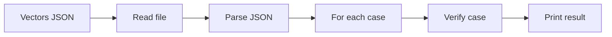

# JSON CLI (merkle-verify-json)

Purpose: verify many proofs from a JSON file and print true/false per case.

- Entry: `Merkle.JsonCli` (executable: `merkle-verify-json`)
- Reads an array of cases: `{ root, leaf, path: [{ dir, sib }, ...] }`
- Labels are byte lists (e.g., `[12]`), not plain integers.
- Directions are strings: `"left"` or `"right"`.

## Flow


## Example JSON (correct schema)
```json
[
  {
    "name": "mini-L2",
    "root": [1, 1, 10, 11, 1, 12, 13],
    "leaf": [12],
    "path": [
      { "dir": "right", "sib": [13] },
      { "dir": "left",  "sib": [1, 10, 11] }
    ]
  },
  {
    "name": "empty-path-example",
    "root": [9],
    "leaf": [9],
    "path": []
  }
]
```

## How to run
```bash
lake build merkle-verify-json && lake exe merkle-verify-json docs/sample-vectors.json
```

## Defaults

- If you omit the file argument, the CLI defaults to `docs/sample-vectors.json`:

```bash
lake exe merkle-verify-json
```

This behavior is implemented in `src/Merkle/JsonCli.lean`.

## Hashing notes (must match code)

- Domain tags: `tagLeft = 0`, `tagRight = 1`.
- Parent construction in examples uses `hashRight left right`.
- The fold uses `hashRight sib acc` for left-steps and `hashRight acc sib` for right-steps.
- If you change tags or hashing in `src/Merkle/Verify.lean`, you must update/recompute the JSON vectors accordingly.

## Blockchain mapping
- Mirrors how an indexer or light client might batch-verify proofs against a known root.
- Adaptable to contract calls or off-chain validation pipelines.

## Troubleshooting

- "JSON parse/decode error": check field names (`leaf` not `value`), directions (`"left"`/`"right"`), and that labels are byte lists (e.g., `[12]`).
- "file not found": pass a correct path or rely on the default `docs/sample-vectors.json`.
- Verification returns `false`: the `(root, leaf, path)` triple does not match the current hashing rules. Recompute the root using the code or use the verbose fold in `src/Merkle/Demo.lean` to derive the correct root.
