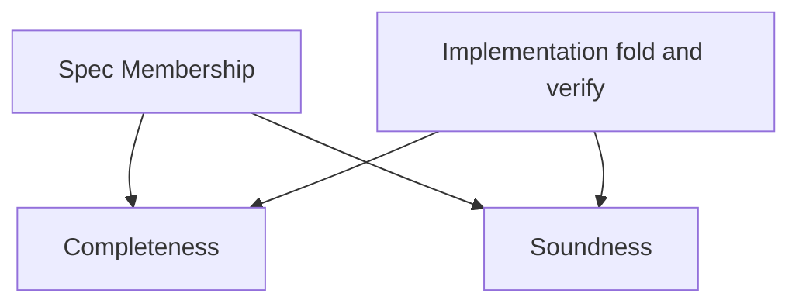

# Theorems (linking Spec and Verify)

Purpose: state/prove guarantees that the executable checker agrees with the declarative spec.

- fold_eq_of_membership: spec path implies fold computes the same root
- completeness: if Membership holds then verify returns true
- membership_fold_self: folded path represents a valid membership
- soundness: if verify returns true then Membership holds

## Flowchart

## Why this matters
- Confidence: the implementation and the model are consistent.
- Extensibility: when you swap the hash function, these properties should still hold.

## Blockchain mapping
- Mirrors formal specs vs. client/contract code: ensures the verifier isn’t accepting invalid proofs.

## Notes
- Some proofs may be `sorry` placeholders initially; fill them as you iterate.
